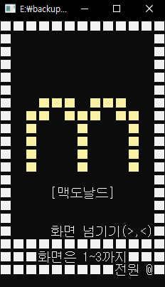
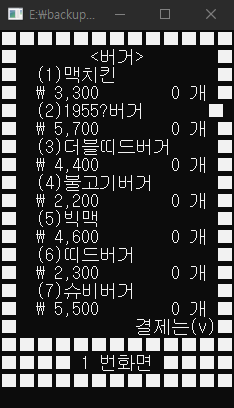
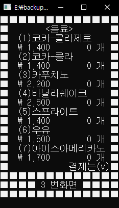
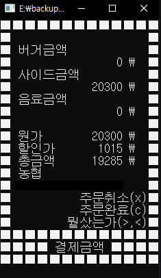
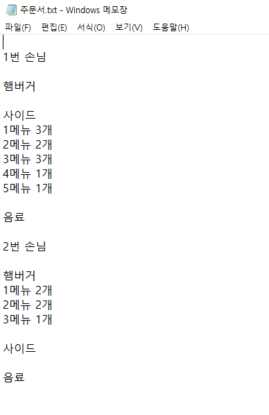

the_first_c_project
==========
> 첫 c 언어 프로젝트

#### 첫 c 프젝트로 만든것은 맥도날드 키호스크 입니다.
-----------------
'''
   +----------------------+
   |       시작화면       |
   +----------------------+
              |
              v
   +----------------------+
   |       메인화면       |
   +----------------------+
   |   < > 입력하여 화면  |
   |       전환하기       |
   +----------------------+
              |
              v
   +----------------------+
   |       선택화면       |
   +----------------------+
   |  숫자 입력하여 상품   |
   |  선택하고 장바구니에  |
   |        추가하기       |
   +----------------------+
              |
              v
   +----------------------+
   |       결제화면       |
   +----------------------+
   |   'v' 입력하여 결제   |
   |     창으로 이동하기   |
   +----------------------+
              |
              v
   +----------------------+
   |       할인화면       |
   +----------------------+
   |  할인 적용 또는 결제  |
   |      선택하기        |
   +----------------------+
              |
              v
   +----------------------+
   |       메인화면       |
   +----------------------+

'''

- ### main 화면  
  
- ### 선택 화면  
&nbsp;
&nbsp;
  
- ### 결제 화면  
&nbsp;
  
- ### 주문 txt 파일 

후일담
---------------
내 최초의 프로젝트이다. 지금 와서 봤을 때는 광장의 투박하고 고칠 점이 많이 보이지만
그 당시 나는 잘 만들었다고 지금도 상징성으로는 좋은 작품이라고 생각한다.
